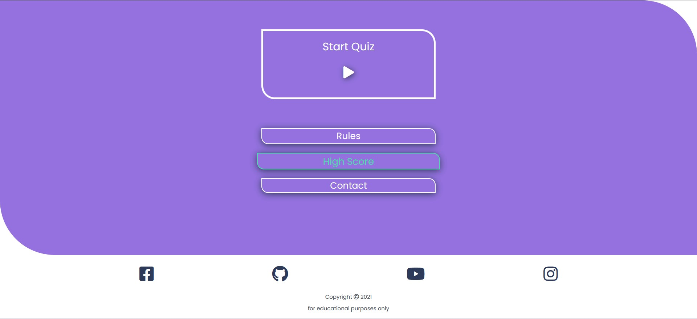
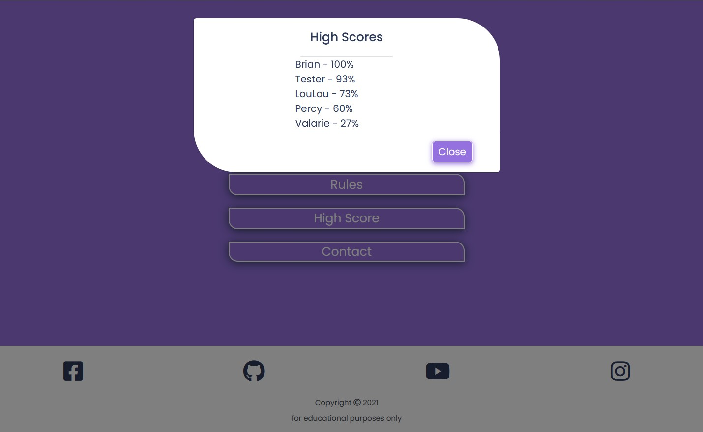
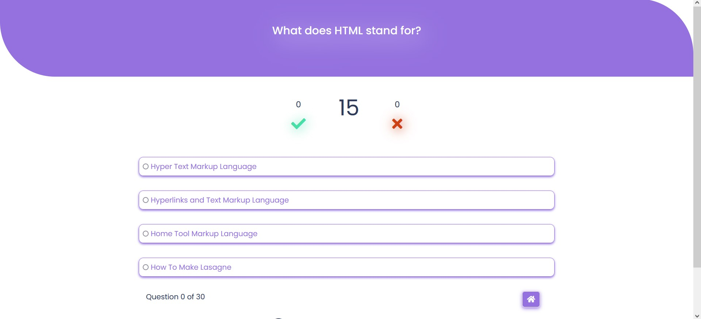
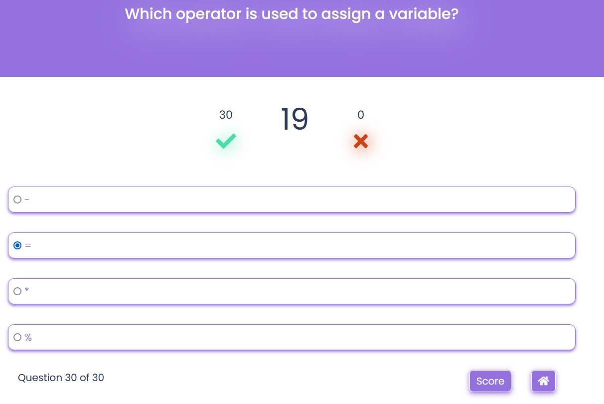
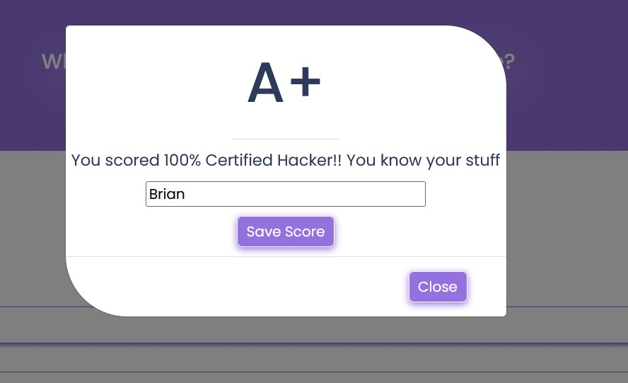
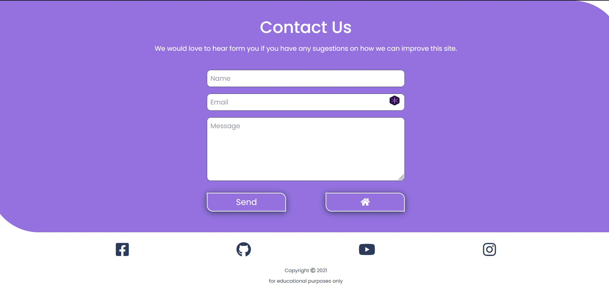
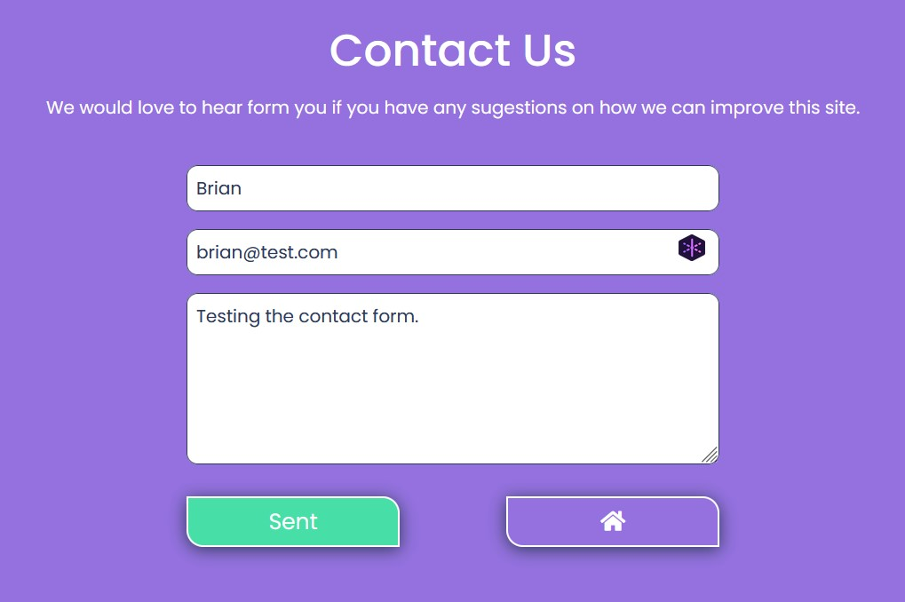
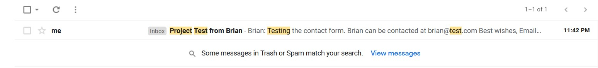
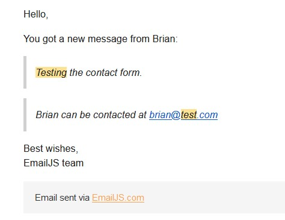
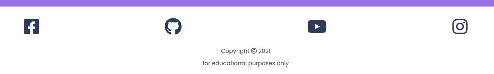

# CI-MS2-Quizlet
[Live Site](https://brian-fullstack.github.io/CI-MS2-Quizlet/)

# Introduction
Quizlet is an interactive quiz which tests users knowledge if the three Frontend Development languages. HTML, CSS and Javascript. Quiz challenges users to beat their high scores by answering each question correctly before time runs out.

# UX
## Scope
The main purpose of this site is to help users establish where the gaps in their knowledge are, in terms of frontend fundamentals. By giving the users an option of saving their score it may entice users to return to the site to better their previous score.

## Site Demographic
- Beginners in HTML, CSS and JavaScript
- Self taught programmers
- Programmers who want to test their knowledge of these languages
- People who want to solidify the knowledge that they already have

# User Stories
## User Goals
|   |   |
|---|---|
|1.| As a user I want to easily navigate throught the site.|
|2.| As a user I want to know how the quiz works before I start playing.|
|3.| As a user I want to know how many questions I got right or wrong.|
|4.| As a user I want to be able to tell how many questions are left.|
|5.| As a user I want to be able to exit the quiz whenever I want.|
|6.| As a user I want to know my score when I finish the quiz.|
|7.| As a user I want to save my score.|
|8.| As a user I want to be able to see my past scores.|
|9.| As a user I want to be able to contact the site owner.|
|10.| As a user I want to be able to use this site on all my devices.|

## Site Owner Goals
|   |   |
|---|---|
|1.| As a site owner I want a responsive site.
|2.| As a site owner I want each question to be timed.
|3.| As a site owner I want a way to be contacted by users.
|4.| As a site owner I want to be notified about any contact from the site.
|5.| As a site owner I want users to be able to check out my social media pages.
|6.| As a site owner I want the site to be easy and intuituve to use.

# Design

## Structure
- Quizlet is a multi-page site consisting of three pages and three modals.
    - Home Page
    - Quiz Page
    - Contact Page
    - Rules Modal
    - High Scores Modal
    - Results Modal
- Each page will share a common footer.
- The Home Page is where users can navigate to all other pages,read the rules and see the scoreboard.
- The Quiz Page will display the quiz questions and answers, the countdown clock, the score and progress as well as a button to exit the quiz.
-  The Contact Page is where users can send send a message to the site owner if needed.
The Rules Modal is triggered from the Home Page and shows a list of rules and a button to close.
- The High Scores Modal is also triggered from the Home Page and displays the high scores and a button to close.
- The Results Modal is triggered by a button only displayed when the last question has been asnwered on the Quiz Page.

## Colours
The colors used throughout this site are simple and selected not to be a distraction to the users while they answer the questions.

| Color Use  | HEX Code  | Color  |
|------------|-----------|--------|
|Containers, Buttons & Text | #9471DF |  |
|Social Icons, Timer & Count | #2E3A59 |  |
|Hover Effects & Correct Icon | #48DEA8 |  |
|Incorrect Icon | #CD4115 |  |
|Background and Text | #FFFFFF |  |

## Wireframes
The wireframes for this site were made using [Figma](https://www.figma.com/). High fidelity mockups for the most common screen sizes can be found here.

[Mobile](doc/wireframes/mobile-figma-wireframes.jpg)

[Tablet](doc/wireframes/tablet-figma-wireframes.jpg)

[Desktop](doc/wireframes/desktop-figma-wireframes.jpg)

# Features

## Feature 1 - Home Page
The Home Page is where users can easially navigate throught the site.
### Start Quiz
- This is the main call to action. Positioned at the top of the page this simply calls the user to start the quiz by clicking the play arrow.
#### Navigation Buttons
- These are used as a very clear way for the users to navigate throughout the site. Added hover effects make it clear to the user that the buttons bring them somewhere or reveal some information.

#### Rules Modal
- Implemented using [Bootstrap](https://getbootstrap.com/) this modal gives users a list of instructions on how the quiz works.

#### High Score Modal
- Implemented using [Bootstrap](https://getbootstrap.com/) this modal gives users a list of past high scores. The scores are arranged from highest to lowest.

#### Contact Button
- Users can access the contact page if they wish to get in contact with the site owner.
## The user/site owner goals that this feature covers are:
|   |   |
|---|---|
|1.| As a user I want to easily navigate throught the site.|
|2.| As a user I want to know how the quiz works before I start playing.|
|8.| As a user I want to be able to see my past scores.|
|6.| As a site owner I want the site to be easy and intuituve to use.
___
## Feature 2 - Quiz Page
The Quiz Page has six different componants and is the busiest page on the site.

#### Question Container
- Displays the current question. I made the container the same colour and shape as the Home page which adds continuity across the site.
#### Countdown Timer
- Adds an element of pressure to the user. The timer is designed to increment the wrong answer count and move on to the next question if the user doesn't answer the question in time.
#### Right and Wrong Counters
- These are used to show the user exactly how many questions they got right or wrong.
#### Answer Selection
- Displays one right and three wrong answers for the user to choose from.
#### Question Counter
- Shows users which question they are on and lets them be aware of how many questions are left in the quiz.
#### Home Button
- When users click the Home Button before the end of the quiz, progress will be lost and users will have to start the quiz from the start again.
- The Home Button features on both the Quiz Page and Contact Page, it is used to give a sense of security to users by letting them find their way back to the Home Page. 
## The user/site owner goals that this feature covers are:
|   |   |
|---|---|
|3.| As a user I want to know how many questions I got right or wrong.|
|4.| As a user I want to be able to tell how many questions are left.|
|5.| As a user I want to be able to exit the quiz whenever I want.|
|2.| As a site owner I want each question to be timed.
___
## Feature 3 - Save Score Modal
The trigger for the Save Score Modal is only displayed once the final question of the quiz has been answered.

#### Quiz Grade
- The user is given a grade of A,B,C..etc.
- The users score is calculated and they are given a percentage and a different message depending on what percentage they scored.
#### Username
- Useres are promped to save their score and username by an input box.
- If users have a top score their score will be saved and added to the scoreboard

## The user/site owner goals that this feature covers are:
|   |   |
|---|---|
|6.| As a user I want to know my score when I finish the quiz.|
|7.| As a user I want to save my score.|
___
## Feature 4 - Contact Page

#### Form
- [Email.JS](https://www.emailjs.com/) API is used to handle emails sent to the site owner.
- Users are given validation that their email has been sent when the 'Send' button turns green and displays 'Sent'.

- The site owner gets a prompt in their email inbox that a message has been sent from the site form. They are given the users Username, email and the message. 

## The user/site owner goals that this feature covers are:
|   |   |
|---|---|
|9.| As a user I want to be able to contact the site owner.|
|3.| As a site owner I want a way to be contacted by users.
|4.| As a site owner I want to be notified about any contact from the site.
____
## Feature 5 - Footer
This is a common feature that is displayed throughout the site. It allows users to contact the site owner via social media.

## The user/site owner goals that this feature covers are:
|   |   |
|---|---|
|5.| As a site owner I want users to be able to check out my social media pages.
|   |   |

## Features for future releases

# Languages, Frameworks and Technologies Used

- [HTML](https://html.com/) is used to make up the structure of this site and add copy.
- [CSS](https://css-tricks.com/) used to add styling throughout the site.
- [JavaScript](https://www.javascript.com/) used to add interactivity to the sites features. Control the timing and to calculate the scores.
- [Bootstrap 5](https://getbootstrap.com/) is used for implementing the modals.
- [JQuery](https://jquery.com/) came with Bootstrap in order to add functionality to the modals.
- [Email.JS](https://www.emailjs.com/) is used to add functionality to the forms without the need for backend.
- [Font Awsome](https://fontawesome.com/) is used for adding icons throughout this site.
- [Coolors](https://coolors.co/) is where I got inspiration for the colors on this site.
- [GitHub](https://github.com/) is used as a remote repository for this project.
- [Git](https://git-scm.com/) is used for version control by commiting and pushing changes to GitHub.
- [Visual Studio Code](https://code.visualstudio.com/) is the IDE I used for writing the code.
- [Figma](https://www.figma.com/) was where I created all wireframes for this site.
- [Am I Responsive](http://ami.responsivedesign.is/#) is used for creating the image at the top and to check for responsiveness.
- [Firefox Dev Tools](https://developer.mozilla.org/en-US/docs/Tools) was used to test for responsiveness and to help with debugging as this site was being developed.
- [Google Lighthouse](https://developers.google.com/web/tools/lighthouse) was used to test the performance of this site.
- [Beautify](https://marketplace.visualstudio.com/items?itemName=HookyQR.beautify) is a VSCode extension I used to keep the code clean throughout. 

## Testing User Stories
__

1.
| Feature | Action | Expected Result |  Actual Result |
|---------|--------|-----------------|----------------|
|         |        |                 |                |

[See image result Here](url)
__

2.
| Feature | Action | Expected Result |  Actual Result |
|---------|--------|-----------------|----------------|
|         |        |                 |                |

[See image result Here](url)
__

3.
| Feature | Action | Expected Result |  Actual Result |
|---------|--------|-----------------|----------------|
|         |        |                 |                |

[See image result Here](url)
__

4.
| Feature | Action | Expected Result |  Actual Result |
|---------|--------|-----------------|----------------|
|         |        |                 |                |

[See image result Here](url)
__

## Testing Site Owner Goals
__

1.
| Feature | Action | Expected Result |  Actual Result |
|---------|--------|-----------------|----------------|
|         |        |                 |                |

[See image result Here](url)
__

2.
| Feature | Action | Expected Result |  Actual Result |
|---------|--------|-----------------|----------------|
|         |        |                 |                |

[See image result Here](url)
__

3.
| Feature | Action | Expected Result |  Actual Result |
|---------|--------|-----------------|----------------|
|         |        |                 |                |

[See image result Here](url)
__

4.
| Feature | Action | Expected Result |  Actual Result |
|---------|--------|-----------------|----------------|
|         |        |                 |                |

[See image result Here](url)
__

### HTML Validation

### CSS Validation

### JS Validation

### Lighthouse Testing

### Responsiveness

# Bugs in Development
Bug -

Fix -

Bug -

Fix -

Bug -

Fix -

Bug -

Fix -

# Deployment

# Credits